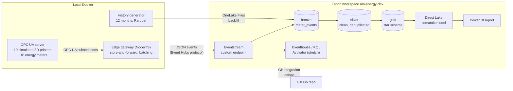

# fabric-am-energy

Energy monitoring for a park of laser-sintering 3D printers, built end to end in Microsoft Fabric.

> **What this is.** A personal portfolio project on **simulated data**, inspired by an energy-monitoring project I
> built in 2019 (OPC UA aggregation client, InfluxDB, Grafana, alerts on over-long heat-up phases). No real machine,
> customer or company data is used. Every power and timing parameter is an assumption, listed in
> [`config/assumptions.yaml`](config/assumptions.yaml).
>
> Microsoft Fabric DP-700 (Fabric Data Engineer Associate): in preparation.

## Architecture



## Repository layout

| Path | Contents |
|---|---|
| `config/` | Simulation assumptions (power, timing, fault rates) |
| `edge/` | TypeScript: OPC UA simulator, edge gateway, history generator, shared event schema |
| `spark/` | Silver and gold transformations as a Python package, tested locally |
| `fabric/` | Fabric item definitions, written by Fabric Git integration |
| `model/` | Gold star schema and DAX measures |
| `scripts/` | Fabric CLI / REST helpers |
| `docs/` | Design decisions and screenshots |

## Run the edge side

Needs Docker. The gateway writes JSON lines inside its volume until a Fabric Eventstream is configured in `.env`.

```bash
cp .env.example .env
docker compose up --build                 # OPC UA simulator + edge gateway
docker compose kill -s USR1 gateway       # toggle a simulated network outage (buffer, then replay)
docker compose exec gateway tail -f /data/out/events-$(date -u +%F).jsonl
```

Set `DURATION_SCALE=0.0333` in `.env` to run job cycles 30 times faster for a demo. Tests: `cd edge && npm ci && npm test`.

## Status

Work in progress. Sections still to come: design decisions, how to reproduce, DP-700 skill mapping, limits, and what
a production setup would add.

## License

[MIT](LICENSE)
