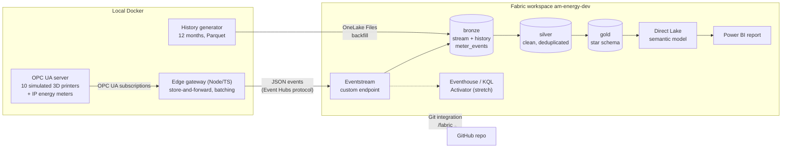

# fabric-am-energy

Energy monitoring for a park of laser-sintering 3D printers, built end to end in Microsoft Fabric.

> **What this is.** A personal portfolio project on **simulated data**, inspired by an energy-monitoring project I
> built in 2019 (OPC UA aggregation client, InfluxDB, Grafana, alerts on over-long heat-up phases). No real machine,
> customer or company data is used. Every power and timing parameter is an assumption, listed in
> [`config/assumptions.yaml`](config/assumptions.yaml).
>
> Microsoft Fabric DP-700 (Fabric Data Engineer Associate): in preparation.

## Architecture



## Repository layout

| Path | Contents |
|---|---|
| `config/` | Simulation assumptions (power, timing, fault rates) |
| `edge/` | TypeScript: OPC UA simulator, edge gateway, history generator, shared event schema |
| `spark/` | Silver and gold transformations as a Python package, tested locally |
| `fabric/` | Fabric item definitions, written by Fabric Git integration |
| `model/` | Gold star schema and DAX measures |
| `scripts/` | Fabric CLI / REST helpers |
| `docs/` | Design decisions and screenshots |

## Run the edge side

Needs Docker. The gateway writes JSON lines inside its volume until a Fabric Eventstream is configured in `.env`.

```bash
cp .env.example .env
docker compose up --build                 # OPC UA simulator + edge gateway
docker compose kill -s USR1 gateway       # toggle a simulated network outage (buffer, then replay)
docker compose exec gateway tail -f /data/out/events-$(date -u +%F).jsonl
```

History for the backfill (12 months, about 5M rows, written to `data/history/` with a `ground_truth.json` of the
injected faults): `cd edge && npm run history`.

Set `DURATION_SCALE=0.0333` in `.env` to run job cycles 30 times faster for a demo. Tests: `cd edge && npm ci && npm test`.

## Transformations (local tests)

`spark/` is a Python package of pure DataFrame functions (bronze → silver → gold) that runs unchanged in local tests and
in Fabric (as a wheel in a Fabric Environment). Local tests use the versions of Fabric Runtime 2.0 (Spark 4.1,
Delta 4.2, Python 3.13) and need Java 17+:

```bash
cd spark && uv sync && uv run pytest     # end-to-end tests use data/history from `npm run history`
```

## Design

- [Design decisions](docs/decisions.md): why the edge, the pipeline and the platform are built the way they are.
- [Semantic model](model/README.md): star schema, DAX measures, row-level security and report pages.

## Progress

Updated at every step. Phases follow the project plan; ✅ done, 🔄 in progress, ⬜ not started.

| Phase | What | State |
|---|---|---|
| 0 | Everything that runs without Fabric: simulator, gateway, history, transformations, model on paper | ✅ |
| 1 | Fabric platform: capacity, workspace, Git integration | ✅ |
| 2 | Ingestion: live stream and history into bronze | ✅ |
| 3 | Silver and gold, orchestration, table maintenance | 🔄 silver |
| 4 | Direct Lake semantic model and Power BI report | ⬜ |
| 5 | Stretch: Eventhouse/KQL, Activator alert, deployment pipeline, CI/CD | ⬜ |
| 6 | Packaging: README, screenshots, demo video | ⬜ |

### What has been built so far

**Edge (local Docker).** An OPC UA server simulates 10 laser-sintering 3D printers in two halls, each with an IP
energy meter. Each 3D printer cycles through idle, heat-up, building, cool-down and unpacking, and the meters inject
realistic faults: dropouts, spikes, Bad status codes, a meter swap with a counter reset, over-long heat-ups. An edge
gateway subscribes over OPC UA, numbers each meter's events, buffers them in SQLite and forwards them to Fabric; a
simulated network outage makes it replay the backlog, which produces late, out-of-order and duplicate events on
purpose. A generator writes 12 months of history (5.2M rows, Parquet) from the same model, with a ground-truth file
of every injected fault.

**Transformations (tested locally first).** Bronze → silver → gold logic lives in a Python package (`spark/`,
24 tests on Spark 4.1 / Delta 4.2, the versions of Fabric Runtime 2.0). Tests compare the pipeline's output with the
ground truth: every measurement survives exactly once, energy is conserved per meter, over-long heat-ups are found.

**Fabric platform.** A paid F4 capacity in Sweden Central, paused whenever it isn't used (a new tenant gets no Fabric
trial; see decision 19). Workspace `am-energy-dev` runs Spark Runtime 2.0 and is connected to this repository's
`/fabric` folder through Git integration, so every Fabric item is versioned here as text. Workspace, Spark settings
and Git connection are created by script (`scripts/`).

**Ingestion.** One Lakehouse `lh_energy` with `bronze`, `silver` and `gold` schemas.
- *Live:* gateway → Eventstream (custom endpoint, Event Hubs protocol) → `bronze.stream_meter_events`.
- *History:* Parquet files uploaded to OneLake → notebook `nb_load_history_bronze` → `bronze.history_meter_events`,
  as a full load and incrementally with a file-time watermark.

**Silver (in progress).** Notebook `nb_silver` reads both bronze tables with Spark Structured Streaming
(`availableNow`, so each run processes only new rows), checks data quality, sends rejected rows to
`silver.quarantine` with a reason, and writes `silver.meter_readings` with an idempotent insert-only MERGE.

**Next.** Gold star schema, a scheduled pipeline with table maintenance, then the semantic model and report.

### How code reaches Fabric

The transformation code is built into a Python wheel (`cd spark && uv build --wheel`) and attached to the Fabric
Environment `env_am_energy` through Git (`fabric/env_am_energy.Environment/Libraries/CustomLibraries/`). After
**Update** from Git and **Publish**, every notebook using that environment imports the same tested code
(`from am_energy.silver import …`); notebooks only hold paths, parameters and orchestration.

## License

[MIT](LICENSE)
