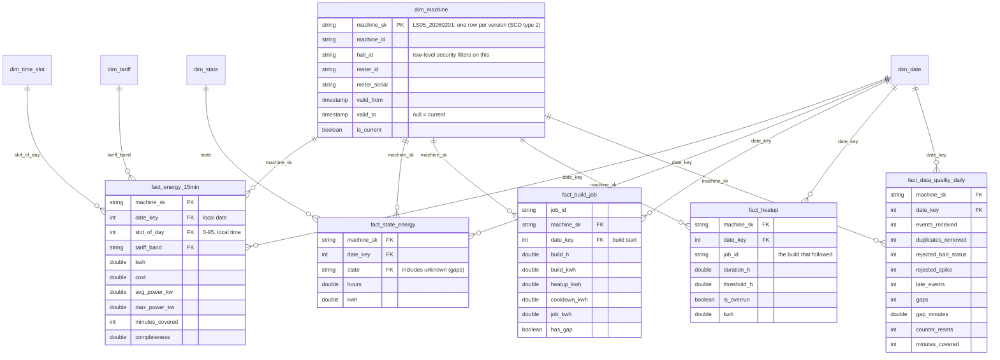

# Semantic model (design)

Direct Lake on OneLake over the gold tables of `lh_energy`. Built and edited in the browser (web modeling); the
definition is stored in Git as TMDL through Fabric Git integration.

## Star schema



Small dimensions still to add in gold (Phase 3): `dim_time_slot` (slot → "07:15", hour, tariff band label) and
`dim_state` (state, display name, sort order, so "unknown" sorts last).

**Rules for this model:**
- **Facts reference a dim_machine version, not a machine.** Every fact row gets the version that was valid at its
  timestamp (`attach_machine_sk`). Energy used by LS05 before its move in February stays in hall H1. Slicers use
  `machine_id`, which groups all versions of one 3D printer.
- **Relationships are many-to-one, single direction**, from fact to dimension. No bidirectional filters, no
  fact-to-fact relationships.
- **No calculated columns.** Keys and derived columns (`date_key`, `slot_of_day`, `tariff_band`, `cost`) come from
  gold. That keeps the model pure Direct Lake and the logic in one tested place. (Check in Phase 4 what Direct Lake
  on OneLake allows today.)
- **Time is local.** `date_key` and `slot_of_day` are Europe/Berlin local time. Raw timestamps stay UTC in silver.
- **Mark `dim_date` as the date table** so time intelligence works.

## Measures

Table `_Measures` (an empty table that only holds measures). Draft DAX:

```dax
-- Energy and cost
Energy kWh          = SUM ( fact_energy_15min[kwh] )
Energy cost         = SUM ( fact_energy_15min[cost] )
Avg price per kWh   = DIVIDE ( [Energy cost], [Energy kWh] )
Peak share          = DIVIDE ( CALCULATE ( [Energy kWh], dim_tariff[tariff_band] = "peak" ), [Energy kWh] )
Energy kWh PM       = CALCULATE ( [Energy kWh], DATEADD ( dim_date[date], -1, MONTH ) )
Energy kWh vs PM %  = DIVIDE ( [Energy kWh] - [Energy kWh PM], [Energy kWh PM] )

-- Build jobs
Build jobs          = COUNTROWS ( fact_build_job )
kWh per job         = DIVIDE ( SUM ( fact_build_job[job_kwh] ), [Build jobs] )
kWh per build hour  = DIVIDE ( SUM ( fact_build_job[build_kwh] ), SUM ( fact_build_job[build_h] ) )

-- Machine states
State hours         = SUM ( fact_state_energy[hours] )
Idle share          =
    DIVIDE (
        CALCULATE ( [State hours], dim_state[state] = "idle" ),
        CALCULATE ( [State hours], dim_state[state] <> "unknown" )
    )
Idle energy kWh     = CALCULATE ( SUM ( fact_state_energy[kwh] ), dim_state[state] = "idle" )

-- Heat-ups (the 2019 alert)
Heat-ups            = COUNTROWS ( fact_heatup )
Heat-up overruns    = CALCULATE ( [Heat-ups], fact_heatup[is_overrun] = TRUE () )
Heat-up overrun rate = DIVIDE ( [Heat-up overruns], [Heat-ups] )
Avg heat-up h       = AVERAGE ( fact_heatup[duration_h] )

-- Data quality
Events received     = SUM ( fact_data_quality_daily[events_received] )
Duplicates removed  = SUM ( fact_data_quality_daily[duplicates_removed] )
Rejected readings   =
    SUM ( fact_data_quality_daily[rejected_bad_status] )
        + SUM ( fact_data_quality_daily[rejected_spike] )
        + SUM ( fact_data_quality_daily[rejected_implausible_power] )
        + SUM ( fact_data_quality_daily[rejected_missing_value] )
        + SUM ( fact_data_quality_daily[rejected_negative_value] )
Late events         = SUM ( fact_data_quality_daily[late_events] )
Data completeness % =
    DIVIDE (
        SUM ( fact_data_quality_daily[minutes_covered] ),
        1440 * COUNTROWS ( dim_date ) * DISTINCTCOUNT ( dim_machine[machine_id] )
    )
```

**Points to understand before building (Power BI last used in 2017):**
- **`CALCULATE` changes the filter context.** In `Peak share`, the numerator replaces any tariff filter with "peak".
  The denominator keeps the filter the visual sets.
- **`DIVIDE` instead of `/`.** It returns blank instead of an error when the denominator is 0 or blank.
- **Completeness divides by the expected minutes.** It doesn't divide by the rows that exist, so a meter that sent
  nothing all day counts as 0 % instead of disappearing. `COUNTROWS ( dim_date )` respects the date slicer.
- **`DATEADD` needs a marked date table** with contiguous dates.
- **Idle share excludes "unknown".** A gap is not idle time; it is missing data, and the data quality page shows it.

## Row-level security

One role per hall, filtering `dim_machine[hall_id]`: role `Hall H1` = `[hall_id] = "H1"`, role `Hall H2` =
`[hall_id] = "H2"`. Because the filter is on the dimension version, a hall manager sees the 3D printers that were in
the hall at the time of each fact. In Direct Lake on OneLake, model RLS doesn't trigger a DirectQuery fallback (SQL
endpoint RLS would). Check in Phase 4 whether web modeling can define roles; otherwise edit the TMDL in Git.

## Report pages

1. **Park overview:** kWh, cost and peak share by hall and month; intraday profile by `slot_of_day`; top 3D printers.
2. **Machine drill-down:** one 3D printer: state timeline (hours per state per day), kWh by state, idle share.
3. **Build jobs:** kWh per job, kWh per build hour, distribution, jobs with gaps marked.
4. **Heat-up anomalies:** overruns over time, duration vs threshold, list with job ids.
5. **Data quality:** events received vs valid, duplicates, rejections by reason, late events, gaps, completeness per
   meter per day, counter resets.
